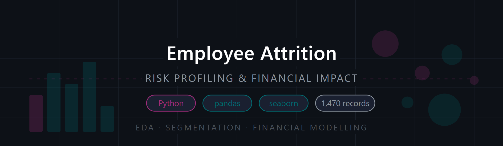
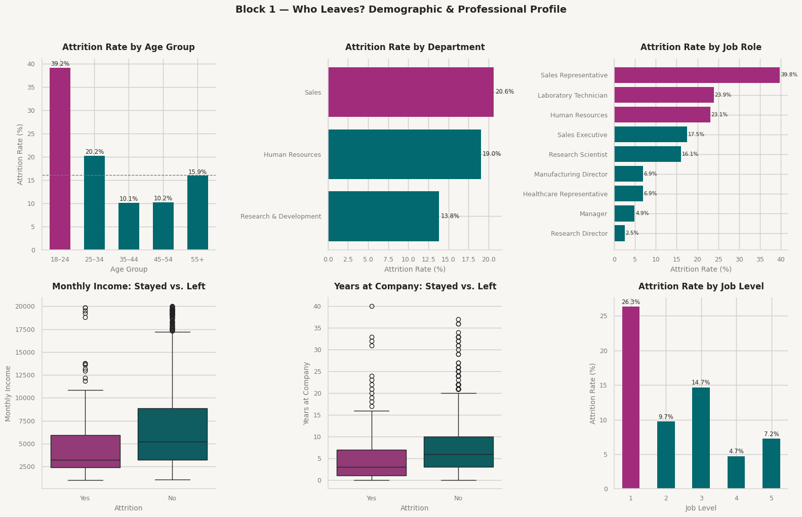
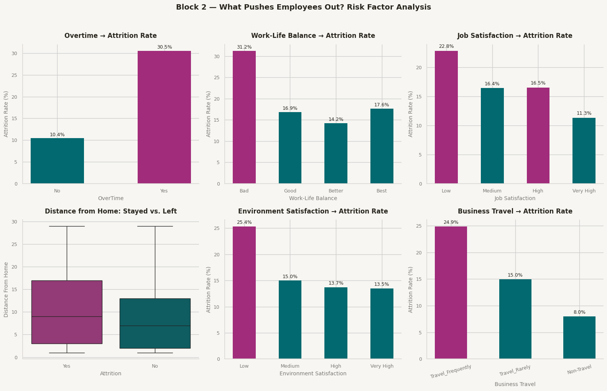
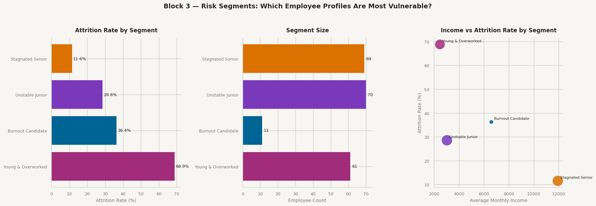
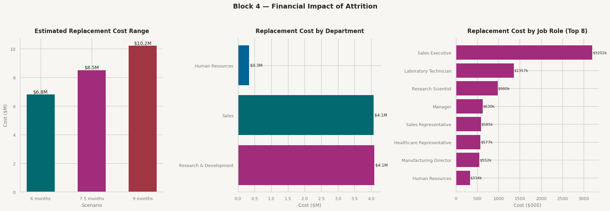

# Employee Attrition: Risk Profiling & Financial Impact



## Overview

This project performs an end-to-end exploratory data analysis of employee attrition using the IBM HR Analytics dataset. Rather than treating it as a machine learning classification problem, the goal is to answer four business questions through structured analytical reasoning: who leaves, what pushes them out, which employee profiles are most at risk, and what the financial cost of inaction looks like.

The analysis is structured as a four-block narrative in a Jupyter Notebook, using Python exclusively — pandas for all aggregation and segmentation logic, seaborn and matplotlib for static visualisations, with a consistent design system applied throughout.

---

## Objective

- Profile attrition across demographic, professional, and behavioural dimensions
- Identify the risk factors with the strongest association to employee departure
- Define analytical risk segments using pandas filtering — without machine learning
- Translate attrition patterns into estimated replacement costs with sensitivity scenarios

---

## Dataset

| Field | Detail |
|---|---|
| **Source** | [IBM HR Analytics Employee Attrition & Performance — Kaggle](https://www.kaggle.com/datasets/pavansubhasht/ibm-hr-analytics-attrition-dataset) |
| **Records** | 1,470 employees |
| **Features** | 35 columns |
| **Target** | `Attrition` (Yes / No) — 16.1% positive rate |
| **Nulls** | 0 |

### Key Variables Used

| Variable | Type | Description |
|---|---|---|
| `Attrition` | Categorical | Target — whether the employee left |
| `Age` | Numeric | Employee age |
| `MonthlyIncome` | Numeric | Monthly salary in USD |
| `OverTime` | Categorical | Whether the employee works overtime |
| `YearsAtCompany` | Numeric | Tenure in years |
| `JobSatisfaction` | Ordinal (1–4) | Self-reported job satisfaction score |
| `EnvironmentSatisfaction` | Ordinal (1–4) | Satisfaction with the work environment |
| `WorkLifeBalance` | Ordinal (1–4) | Self-reported work-life balance score |
| `BusinessTravel` | Categorical | Travel frequency (None / Rarely / Frequently) |
| `JobLevel` | Ordinal (1–5) | Seniority level within the organisation |
| `YearsSinceLastPromotion` | Numeric | Time since last promotion |
| `NumCompaniesWorked` | Numeric | Number of previous employers |

---

## Tools & Stack

- **Python (pandas + numpy)** — data cleaning, feature engineering, aggregation, segmentation (Google Colab)
- **Seaborn + Matplotlib** — static visualisations with a consistent design system
- **GitHub** — version control and portfolio

---

## Approach

The project is divided into four analytical blocks, each answering a progressively deeper business question.

**Block 1 — Who Leaves?**
Demographic and professional profiling: attrition rates by age group, department, job role, job level, monthly income, and years at company. Establishes the baseline picture of who is leaving.

**Block 2 — What Pushes Employees Out?**
Risk factor analysis: comparing leavers vs stayers across workload (overtime, travel), satisfaction scores (job, environment, work-life balance), and commute distance. Identifies which variables have the strongest association with departure.

**Block 3 — Who Is At Risk?**
Analytical segmentation using pandas boolean conditions — no machine learning. Four risk profiles are defined based on combinations of the strongest risk factors identified in Block 2, with attrition rates and segment sizes compared.

**Block 4 — What Does It Cost?**
Financial impact model: replacement cost estimated at 6, 7.5, and 9 months of monthly salary per leaver (per SHRM / Gallup / Deloitte benchmarks), broken down by department and job role. Converts attrition patterns into a business decision framework.

---

## Setup

```python
%matplotlib inline
import pandas as pd
import numpy as np
import matplotlib.pyplot as plt
import seaborn as sns
import warnings
import os
warnings.filterwarnings('ignore')

# Load data
df = pd.read_csv('WA_Fn-UseC_-HR-Employee-Attrition.csv')
df['Attrition_Binary'] = (df['Attrition'] == 'Yes').astype(int)

# Create output folder
os.makedirs('output', exist_ok=True)

# ── Design system — defined once, applied everywhere ─────────────────────────
STAY    = '#01696f'   # teal       → employees who stayed
LEAVE   = '#a12c7b'   # magenta    → employees who left
BG      = '#f7f6f2'   # off-white  → chart background
TEXT    = '#28251d'   # near-black → titles and annotations
MUTED   = '#7a7974'   # warm gray  → axis labels and reference lines
DIVIDER = '#dcd9d5'   # light gray → spine lines

sns.set_theme(style='whitegrid')

def style_ax(ax, title='', xlabel='', ylabel=''):
    ax.set_facecolor(BG)
    ax.spines[['top', 'right']].set_visible(False)
    ax.spines[['left', 'bottom']].set_color(DIVIDER)
    ax.tick_params(colors=MUTED, labelsize=9)
    ax.set_xlabel(xlabel, color=MUTED, fontsize=10)
    ax.set_ylabel(ylabel, color=MUTED, fontsize=10)
    ax.set_title(title, color=TEXT, fontsize=12, fontweight='bold', pad=12)

print("Setup done. Shape:", df.shape)
```

The colour system uses two semantic constants — `STAY` and `LEAVE` — applied consistently to every chart in the notebook. The `style_ax()` helper function applies the full visual theme to any axes object in a single call, ensuring no chart deviates from the design language.

---

## Block 1 — Who Leaves? Demographic & Professional Profile



```python
df['AgeGroup'] = pd.cut(
    df['Age'],
    bins=[17, 24, 34, 44, 54, 100],
    labels=['18–24', '25–34', '35–44', '45–54', '55+']
)

fig, axes = plt.subplots(2, 3, figsize=(16, 10))
fig.patch.set_facecolor(BG)
fig.suptitle(
    'Block 1 — Who Leaves? Demographic & Professional Profile',
    color=TEXT, fontsize=14, fontweight='bold', y=1.02
)

# 1A — Attrition rate by age group
age_rate = df.groupby('AgeGroup', observed=True)['Attrition_Binary'].mean().mul(100)
ax = axes[0, 0]
bars = ax.bar(
    age_rate.index, age_rate.values,
    color=[LEAVE if v == age_rate.max() else STAY for v in age_rate.values],
    edgecolor='none', width=0.6
)
for b in bars:
    ax.text(
        b.get_x() + b.get_width()/2, b.get_height() + 0.4,
        f'{b.get_height():.1f}%', ha='center', fontsize=8.5, color=TEXT
    )
ax.axhline(df['Attrition_Binary'].mean()*100, color=MUTED, linestyle='--', linewidth=1)
style_ax(ax, 'Attrition Rate by Age Group', 'Age Group', 'Attrition Rate (%)')

# 1B — Attrition by department
dept_rate = df.groupby('Department')['Attrition_Binary'].mean().mul(100).sort_values()
ax = axes[0, 1]
ax.barh(
    dept_rate.index, dept_rate.values,
    color=[LEAVE if v == dept_rate.max() else STAY for v in dept_rate.values],
    edgecolor='none'
)
for i, v in enumerate(dept_rate.values):
    ax.text(v + 0.2, i, f'{v:.1f}%', va='center', fontsize=8.5, color=TEXT)
style_ax(ax, 'Attrition Rate by Department', 'Attrition Rate (%)', '')

# 1C — Attrition by job role
role_rate = df.groupby('JobRole')['Attrition_Binary'].mean().mul(100).sort_values()
ax = axes[0, 2]
ax.barh(
    role_rate.index, role_rate.values,
    color=[LEAVE if v >= role_rate.quantile(0.75) else STAY for v in role_rate.values],
    edgecolor='none'
)
for i, v in enumerate(role_rate.values):
    ax.text(v + 0.2, i, f'{v:.1f}%', va='center', fontsize=7.5, color=TEXT)
style_ax(ax, 'Attrition Rate by Job Role', 'Attrition Rate (%)', '')

# 1D — Monthly income boxplot
ax = axes[1, 0]
sns.boxplot(data=df, x='Attrition', y='MonthlyIncome',
            palette={'No': STAY, 'Yes': LEAVE}, ax=ax)
style_ax(ax, 'Monthly Income: Stayed vs. Left', 'Attrition', 'Monthly Income')

# 1E — Years at company boxplot
ax = axes[1, 1]
sns.boxplot(data=df, x='Attrition', y='YearsAtCompany',
            palette={'No': STAY, 'Yes': LEAVE}, ax=ax)
style_ax(ax, 'Years at Company: Stayed vs. Left', 'Attrition', 'Years at Company')

# 1F — Attrition by job level
job_level_rate = df.groupby('JobLevel')['Attrition_Binary'].mean().mul(100)
ax = axes[1, 2]
bars = ax.bar(
    job_level_rate.index, job_level_rate.values,
    color=[LEAVE if v == job_level_rate.max() else STAY for v in job_level_rate.values],
    edgecolor='none', width=0.5
)
for b in bars:
    ax.text(
        b.get_x() + b.get_width()/2, b.get_height() + 0.4,
        f'{b.get_height():.1f}%', ha='center', fontsize=8.5, color=TEXT
    )
style_ax(ax, 'Attrition Rate by Job Level', 'Job Level', 'Attrition Rate (%)')

plt.tight_layout()
plt.savefig('output/block1_who_leaves.png', dpi=150, bbox_inches='tight', facecolor=BG)
plt.show()
```

`pd.cut()` bins the continuous `Age` column into five labelled cohorts. The colour logic uses a list comprehension — `LEAVE` for the peak value, `STAY` for everything else — so the reader's eye goes directly to the finding without needing to read every label. The dashed reference line in chart 1A marks the company average (16.1%), making above/below immediately visible.

### Findings

- The 18–24 cohort leaves at 39.2% — more than double the company average of 16.1%
- Sales leads departments at 20.6%; R&D is the only department below average at 13.8%
- Sales Representatives (39.8%) and Laboratory Technicians (23.9%) are the two highest-risk roles
- Leavers have a structurally lower income distribution at every quartile
- Median tenure for leavers is 3 years vs 7 years for stayers
- Job Level 1 (entry) leaves at 26.3%, dropping sharply at Levels 3 and 4

---

## Block 2 — What Pushes Employees Out? Risk Factor Analysis



```python
fig, axes = plt.subplots(2, 3, figsize=(16, 10))
fig.patch.set_facecolor(BG)
fig.suptitle(
    'Block 2 — What Pushes Employees Out? Risk Factor Analysis',
    color=TEXT, fontsize=14, fontweight='bold', y=1.02
)

# 2A — Overtime
ot = df.groupby('OverTime')['Attrition_Binary'].mean().mul(100)
ax = axes[0, 0]
bars = ax.bar(
    ot.index, ot.values,
    color=[LEAVE if x == 'Yes' else STAY for x in ot.index],
    edgecolor='none', width=0.5
)
for b in bars:
    ax.text(
        b.get_x() + b.get_width()/2, b.get_height() + 0.5,
        f'{b.get_height():.1f}%', ha='center', fontsize=9, color=TEXT
    )
style_ax(ax, 'Overtime → Attrition Rate', 'OverTime', 'Attrition Rate (%)')

# 2B — Work-life balance
wlb = df.groupby('WorkLifeBalance')['Attrition_Binary'].mean().mul(100)
wlb_map = {1: 'Bad', 2: 'Good', 3: 'Better', 4: 'Best'}
ax = axes[0, 1]
bars = ax.bar(
    [wlb_map[i] for i in wlb.index], wlb.values,
    color=[LEAVE if v == wlb.max() else STAY for v in wlb.values],
    edgecolor='none', width=0.5
)
for b in bars:
    ax.text(
        b.get_x() + b.get_width()/2, b.get_height() + 0.5,
        f'{b.get_height():.1f}%', ha='center', fontsize=9, color=TEXT
    )
style_ax(ax, 'Work-Life Balance → Attrition Rate', 'Work-Life Balance', 'Attrition Rate (%)')

# 2C — Job satisfaction
js = df.groupby('JobSatisfaction')['Attrition_Binary'].mean().mul(100)
sat_map = {1: 'Low', 2: 'Medium', 3: 'High', 4: 'Very High'}
ax = axes[0, 2]
bars = ax.bar(
    [sat_map[i] for i in js.index], js.values,
    color=[LEAVE if v >= js.quantile(0.6) else STAY for v in js.values],
    edgecolor='none', width=0.5
)
for b in bars:
    ax.text(
        b.get_x() + b.get_width()/2, b.get_height() + 0.5,
        f'{b.get_height():.1f}%', ha='center', fontsize=9, color=TEXT
    )
style_ax(ax, 'Job Satisfaction → Attrition Rate', 'Job Satisfaction', 'Attrition Rate (%)')

# 2D — Distance from home
ax = axes[1, 0]
sns.boxplot(data=df, x='Attrition', y='DistanceFromHome',
            palette={'No': STAY, 'Yes': LEAVE}, ax=ax)
style_ax(ax, 'Distance from Home: Stayed vs. Left', 'Attrition', 'Distance From Home')

# 2E — Environment satisfaction
es = df.groupby('EnvironmentSatisfaction')['Attrition_Binary'].mean().mul(100)
ax = axes[1, 1]
bars = ax.bar(
    [sat_map[i] for i in es.index], es.values,
    color=[LEAVE if v == es.max() else STAY for v in es.values],
    edgecolor='none', width=0.5
)
for b in bars:
    ax.text(
        b.get_x() + b.get_width()/2, b.get_height() + 0.5,
        f'{b.get_height():.1f}%', ha='center', fontsize=9, color=TEXT
    )
style_ax(ax, 'Environment Satisfaction → Attrition Rate',
         'Environment Satisfaction', 'Attrition Rate (%)')

# 2F — Business travel
bt = df.groupby('BusinessTravel')['Attrition_Binary'].mean().mul(100).sort_values(ascending=False)
ax = axes[1, 2]
bars = ax.bar(
    bt.index, bt.values,
    color=[LEAVE if v == bt.max() else STAY for v in bt.values],
    edgecolor='none', width=0.5
)
for b in bars:
    ax.text(
        b.get_x() + b.get_width()/2, b.get_height() + 0.5,
        f'{b.get_height():.1f}%', ha='center', fontsize=9, color=TEXT
    )
style_ax(ax, 'Business Travel → Attrition Rate', 'Business Travel', 'Attrition Rate (%)')
ax.tick_params(axis='x', rotation=15)

plt.tight_layout()
plt.savefig('output/block2_risk_factors.png', dpi=150, bbox_inches='tight', facecolor=BG)
plt.show()
```

The numeric satisfaction scales (1–4) are mapped to readable labels using dictionaries before plotting — `wlb_map` and `sat_map` — so the axes communicate meaning rather than arbitrary integers. Overtime colouring is label-driven (`LEAVE if x == 'Yes'`) rather than value-driven, making the intent explicit in the code.

### Findings

- Overtime employees leave at 30.5% vs 10.4% without — a 3× multiplier and the single strongest predictor in the dataset
- Employees rating work-life balance as "Bad" leave at 31.2%, nearly twice those rating it "Better"
- Low job satisfaction correlates with 22.8% attrition vs 11.3% at "Very High"
- Leavers have a higher median distance from home, suggesting commute friction compounds other dissatisfaction factors
- Low environment satisfaction (25.4%) is the second strongest satisfaction predictor after job satisfaction
- Frequent travelers leave at 24.9% vs 8.0% for non-travelers

---

## Block 3 — Risk Segments: Which Employee Profiles Are Most Vulnerable?



```python
conditions = [
    (df['Age'] <= 30) & (df['OverTime'] == 'Yes') &
        (df['MonthlyIncome'] < df['MonthlyIncome'].quantile(0.33)),
    (df['Age'] >= 40) & (df['YearsSinceLastPromotion'] >= 4) &
        (df['JobSatisfaction'] <= 2),
    (df['WorkLifeBalance'] == 1) & (df['BusinessTravel'] == 'Travel_Frequently'),
    (df['JobLevel'] == 1) & (df['NumCompaniesWorked'] >= 3) &
        (df['YearsAtCompany'] <= 2),
]
segment_names = [
    'Young & Overworked',
    'Stagnated Senior',
    'Burnout Candidate',
    'Unstable Junior'
]

df['RiskSegment'] = 'Other'
for cond, name in zip(conditions, segment_names):
    df.loc[cond, 'RiskSegment'] = name

segment_summary = (
    df[df['RiskSegment'] != 'Other']
    .groupby('RiskSegment')
    .agg(
        EmployeeCount=('Attrition_Binary', 'count'),
        AttritionRate=('Attrition_Binary', lambda x: x.mean() * 100),
        AvgIncome=('MonthlyIncome', 'mean'),
        AvgAge=('Age', 'mean')
    )
    .reset_index()
    .sort_values('AttritionRate', ascending=False)
)

segment_colors = {
    'Young & Overworked': LEAVE,
    'Stagnated Senior':   '#da7101',
    'Burnout Candidate':  '#006494',
    'Unstable Junior':    '#7a39bb'
}

fig, axes = plt.subplots(1, 3, figsize=(18, 6))
fig.patch.set_facecolor(BG)
fig.suptitle(
    'Block 3 — Risk Segments: Which Employee Profiles Are Most Vulnerable?',
    color=TEXT, fontsize=14, fontweight='bold', y=1.03
)

# 3A — Attrition rate by segment
ax = axes[0]
bars = ax.barh(
    segment_summary['RiskSegment'],
    segment_summary['AttritionRate'],
    color=[segment_colors[s] for s in segment_summary['RiskSegment']],
    edgecolor='none'
)
for i, v in enumerate(segment_summary['AttritionRate']):
    ax.text(v + 0.5, i, f'{v:.1f}%', va='center', fontsize=9, color=TEXT)
style_ax(ax, 'Attrition Rate by Segment', 'Attrition Rate (%)', '')

# 3B — Segment size
ax = axes[1]
bars = ax.barh(
    segment_summary['RiskSegment'],
    segment_summary['EmployeeCount'],
    color=[segment_colors[s] for s in segment_summary['RiskSegment']],
    edgecolor='none'
)
for i, v in enumerate(segment_summary['EmployeeCount']):
    ax.text(v + 1, i, str(v), va='center', fontsize=9, color=TEXT)
style_ax(ax, 'Segment Size', 'Employee Count', '')

# 3C — Income vs attrition rate (bubble chart)
ax = axes[2]
for _, row in segment_summary.iterrows():
    ax.scatter(
        row['AvgIncome'], row['AttritionRate'],
        s=row['EmployeeCount'] * 8,
        color=segment_colors[row['RiskSegment']],
        alpha=0.85, edgecolors='white', linewidth=1.2
    )
    ax.annotate(
        row['RiskSegment'],
        (row['AvgIncome'], row['AttritionRate']),
        xytext=(6, 5), textcoords='offset points',
        fontsize=8, color=TEXT
    )
style_ax(ax, 'Income vs Attrition Rate by Segment',
         'Average Monthly Income', 'Attrition Rate (%)')

plt.tight_layout()
plt.savefig('output/block3_segments.png', dpi=150, bbox_inches='tight', facecolor=BG)
plt.show()
```

Each segment is defined by a boolean condition combining two or three variables identified in Block 2 as the strongest risk factors. The `zip(conditions, segment_names)` loop applies all four in sequence, with later conditions overwriting earlier ones for any overlapping employees — making the priority order explicit. The bubble chart encodes three dimensions simultaneously: income on the x-axis, attrition rate on the y-axis, and segment size as bubble area, illustrating that low income and high attrition are not independent.

### Segment Definitions & Results

| Segment | Definition | Size | Attrition Rate |
|---|---|---|---|
| **Young & Overworked** | Age ≤ 30, overtime = Yes, income < 33rd percentile | 61 | 68.9% |
| **Burnout Candidate** | Work-life balance = Bad, travel = Frequently | 11 | 36.4% |
| **Unstable Junior** | Job Level 1, ≥ 3 previous companies, ≤ 2 years tenure | 70 | 28.6% |
| **Stagnated Senior** | Age ≥ 40, ≥ 4 years since last promotion, job satisfaction ≤ 2 | 69 | 11.6% |

---

## Block 4 — Financial Impact of Attrition



```python
df['ReplacementCost_Low']  = df['MonthlyIncome'] * 6
df['ReplacementCost_Mid']  = df['MonthlyIncome'] * 7.5
df['ReplacementCost_High'] = df['MonthlyIncome'] * 9

leavers = df[df['Attrition'] == 'Yes'].copy()

dept_cost = (
    leavers.groupby('Department')
    .agg(
        Leavers=('Attrition_Binary', 'count'),
        TotalCost=('ReplacementCost_Mid', 'sum')
    )
    .reset_index()
    .sort_values('TotalCost', ascending=False)
)

role_cost = (
    leavers.groupby('JobRole')
    .agg(
        Leavers=('Attrition_Binary', 'count'),
        TotalCost=('ReplacementCost_Mid', 'sum')
    )
    .reset_index()
    .sort_values('TotalCost', ascending=False)
    .head(8)
)

total_low  = leavers['ReplacementCost_Low'].sum()
total_mid  = leavers['ReplacementCost_Mid'].sum()
total_high = leavers['ReplacementCost_High'].sum()

fig, axes = plt.subplots(1, 3, figsize=(18, 6))
fig.patch.set_facecolor(BG)
fig.suptitle(
    'Block 4 — Financial Impact of Attrition',
    color=TEXT, fontsize=14, fontweight='bold', y=1.03
)

# 4A — Cost range across three scenarios
ax = axes[0]
scenario_names = ['6 months', '7.5 months', '9 months']
scenario_vals  = [total_low / 1e6, total_mid / 1e6, total_high / 1e6]
bars = ax.bar(
    scenario_names, scenario_vals,
    color=[STAY, LEAVE, '#a13544'],
    edgecolor='none', width=0.55
)
for b in bars:
    ax.text(
        b.get_x() + b.get_width()/2, b.get_height() + 0.08,
        f'${b.get_height():.1f}M', ha='center', fontsize=10, color=TEXT
    )
style_ax(ax, 'Estimated Replacement Cost Range', 'Scenario', 'Cost ($M)')

# 4B — Cost by department
ax = axes[1]
bars = ax.barh(
    dept_cost['Department'], dept_cost['TotalCost'] / 1e6,
    color=[LEAVE, STAY, '#006494'][:len(dept_cost)],
    edgecolor='none'
)
for i, v in enumerate(dept_cost['TotalCost'] / 1e6):
    ax.text(v + 0.03, i, f'${v:.1f}M', va='center', fontsize=8.5, color=TEXT)
style_ax(ax, 'Replacement Cost by Department', 'Cost ($M)', '')

# 4C — Cost by job role (top 8)
ax = axes[2]
role_cost_sorted = role_cost.sort_values('TotalCost')
bars = ax.barh(
    role_cost_sorted['JobRole'], role_cost_sorted['TotalCost'] / 1e3,
    color=LEAVE, edgecolor='none'
)
for i, v in enumerate(role_cost_sorted['TotalCost'] / 1e3):
    ax.text(v + 3, i, f'${v:.0f}k', va='center', fontsize=8, color=TEXT)
style_ax(ax, 'Replacement Cost by Job Role (Top 8)', 'Cost ($000)', '')

plt.tight_layout()
plt.savefig('output/block4_financial_impact.png', dpi=150, bbox_inches='tight', facecolor=BG)
plt.show()

print(f"Total attrition cost — conservative: ${total_low:,.0f}")
print(f"Total attrition cost — mid estimate: ${total_mid:,.0f}")
print(f"Total attrition cost — high estimate: ${total_high:,.0f}")
```

Three replacement cost columns are computed upfront by multiplying `MonthlyIncome` by 6, 7.5, and 9 — one vectorised row operation across the full dataframe rather than looping. The scenario bar chart uses progressively darker colours to communicate escalating severity visually before the reader processes the numbers. Costs are divided by `1e6` for the department chart and `1e3` for the role chart — scaling to the appropriate unit ($M vs $000) for readability at each level of granularity.

### Results

| Scenario | Multiplier | Estimated Total Cost |
|---|---|---|
| Conservative | 6 months salary | $6.8M |
| Mid estimate | 7.5 months salary | $8.5M |
| High estimate | 9 months salary | $10.2M |

Sales and R&D each absorb ~$4.1M under the mid scenario, despite very different attrition profiles — Sales driven by volume, R&D by higher average salaries. Sales Executives represent the single most expensive departure type at $3.2M total.

---

## Key Findings

- **Overtime is the single most actionable lever** — at 3× the baseline rate, reducing overtime exposure for junior and sales roles would likely yield the highest return on any retention investment
- **Attrition is concentrated in early career** — the 18–24 cohort and Job Level 1 employees leave at rates more than double the company average, suggesting an onboarding and compensation problem rather than a company-wide culture issue
- **The "Young & Overworked" segment has a 68.9% attrition rate** — nearly 7 in 10 employees fitting this profile left, making it the highest-priority intervention target
- **Sales Representatives leave at 39.8%** — the highest of any role, driven by the combination of overtime, travel, and below-median income for the volume of work demanded
- **The financial case for intervention is concrete** — a 20% reduction in attrition would save approximately $1.7M under the mid-cost scenario, likely achievable through overtime policy changes alone

---

## What I Learned

- **Segmentation without ML is underrated** — defining risk profiles with boolean conditions in pandas is more interpretable, faster to iterate, and easier to communicate to non-technical stakeholders than clustering. The segments here tell a clearer story than K-Means centroids would
- **Design consistency changes how analysis reads** — defining a colour palette (`STAY`, `LEAVE`) and a reusable `style_ax()` function at the start means every chart speaks the same visual language. This reduces cognitive load for whoever reads it and signals intentionality rather than ad-hoc work
- **Highlight by exception, not by default** — colouring only the highest-risk bar in each chart rather than using a generic sequential palette directs attention to the finding before the reader processes the label. The visual does the analytical work
- **Three cost scenarios beat one number** — presenting a range ($6.8M–$10.2M) is more honest and more persuasive than a single estimate. It shows the analysis accounts for uncertainty, and the range itself communicates scale regardless of which assumption is correct
- **Attrition rate alone is insufficient** — a 68.9% rate in a segment of 11 employees (Burnout Candidate) is less actionable than a 28.6% rate in a segment of 70 (Unstable Junior). Volume and rate together determine where to focus intervention resources

---

## How to Run

1. Download the dataset from [Kaggle](https://www.kaggle.com/datasets/pavansubhasht/ibm-hr-analytics-attrition-dataset) (`WA_Fn-UseC_-HR-Employee-Attrition.csv`)
2. Upload the CSV and the notebook to Google Colab
3. Run all cells in order — output charts are saved to the `output/` folder automatically

---

## Source

| | |
|---|---|
| **Data** | [IBM HR Analytics — Kaggle](https://www.kaggle.com/datasets/pavansubhasht/ibm-hr-analytics-attrition-dataset) |
| **Platform** | Google Colab |
| **Repository** | [github.com/guilhermeferreira24/employee-attrition-risk-profiling](https://github.com/guilhermeferreira24/employee-attrition-risk-profiling) |
